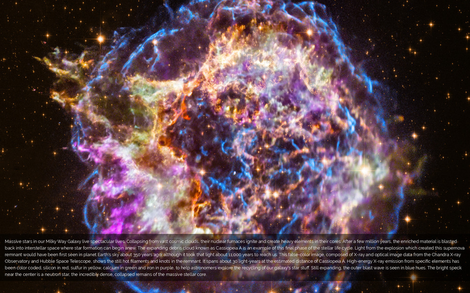

Astronomy Picture of the Day Wallpaper
======================================

This is a Python script that downloads the NASA Astronomy Picture of the Day,
crops and resizes it to a size of your choosing, overlays the explanation text
onto it, and saves the result to a file.

For example, for the
[image of 6 September 2019](https://apod.nasa.gov/apod/ap190906.html):

Requirements
------------

See the `[packages]` section in the `Pipfile`.

Usage
-----

Run `./apodwp.py --help` to see the available options.

Installation
------------

I'm using something like this in my `~/.xprofile` to refresh my wallpaper every
time I log in:

    ~/apodwp/apodwp.py --output_file ~/.apod.png
    feh --no-fehbg --bg-fill ~/.apod.png

This uses `feh` as the background setter; others like `xv` or `hsetroot`
probably work just as well.
